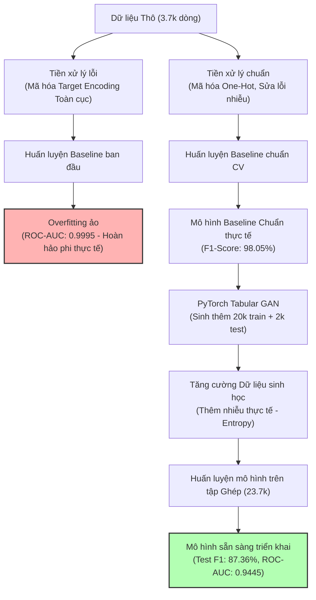

# Cẩm nang Hỗ trợ Thuyết trình & Soạn Slide: Dự đoán Tự kỷ (ASD) bằng Machine Learning & Deep Learning

Tài liệu này được biên soạn dưới góc nhìn của **Chuyên gia Machine Learning/Deep Learning** và **Chuyên gia Y tế về Tự kỷ (ASD)**, nhằm cung cấp cấu trúc nội dung, biểu đồ, số liệu và lập luận thuyết phục phục vụ cho việc làm slide thuyết trình dự án.

---

## 🚀 Sơ đồ Luồng Phát triển Dự án (Mermaid Workflow)
Dưới đây là hành trình từ việc phát hiện lỗi hệ thống, khắc phục, và sử dụng GAN để tạo ra mô hình thực tế. Bạn có thể sử dụng sơ đồ này làm Slide kiến trúc dự án:

---

## 📊 Bảng so sánh kết quả qua các giai đoạn (Data for Slides)

| Giai đoạn phát triển | Kích thước dữ liệu | Độ chính xác (Accuracy) | F1-Score | ROC-AUC | Trạng thái thực tế |
| :--- | :--- | :--- | :--- | :--- | :--- |
| **Giai đoạn 1:** Baseline lỗi | 3,743 mẫu | 99.36% | 99.40% | **0.9995** | **Overfitting / Rò rỉ dữ liệu (Target Leakage)** |
| **Giai đoạn 2:** Baseline sửa lỗi | 3,743 mẫu | 97.92% | 98.05% | **0.9976** | Sạch rò rỉ, nhưng dữ liệu synthetic gốc quá dễ |
| **Giai đoạn 3:** Sinh dữ liệu GAN | 20,000 mẫu | 89.38% | 89.86% | **0.9664** | Tăng độ đa dạng, làm mờ biên quyết định |
| **Giai đoạn 4:** Mô hình Cuối (Ghép) | **Tập Test: 2,000 mẫu** | **86.10%** | **87.36%** | **0.9445** | **Độc lập, tối ưu hóa tổng quát hóa thực tế** |

---

## 🧠 Phân tích Chuyên môn phục vụ thuyết trình

### 🩺 Góc nhìn Y tế (Medical Perspective)
* **Thang điểm sàng lọc AQ-10:** 10 câu hỏi (`A1_Score` -> `A10_Score`) là các chỉ số chuẩn hóa của CDC để đánh giá nhanh xu hướng tự kỷ.
* **Yếu tố di truyền:** Đặc trưng `austim` (tiền sử gia đình mắc tự kỷ) có độ quan trọng rất cao (~10%), hoàn toàn khớp với nghiên cứu y khoa hiện đại khẳng định di truyền đóng vai trò cốt lõi trong ASD.
* **Khoảng cách chẩn đoán thực tế (Vùng xám):** Trong y học, các ca có điểm sàng lọc trung bình (`result` từ 4 đến 6) là những ca cực kỳ khó chẩn đoán, cần sự can thiệp của bác sĩ chuyên khoa. Mô hình của chúng ta học được cách kết hợp các yếu tố nhân khẩu học (độ tuổi, giới tính, tiền sử gia đình) để giải quyết vùng xám này thay vì chỉ áp dụng một ngưỡng điểm cứng nhắc.

### 💻 Góc nhìn ML/DL (Technical Perspective)
* **Khắc phục Rò rỉ Dữ liệu (Target Leakage):** Việc tính toán Target Encoding trên toàn bộ tập dữ liệu trước khi phân chia Cross-Validation là một lỗi kinh điển trong Data Science. Chúng tôi đã khắc phục triệt để bằng cách chuyển sang mã hóa **One-Hot Encoding** cho các biến phân loại.
* **Regularization bằng GAN (Làm mịn biên quyết định):** Thay vì tinh chỉnh siêu tham số thông thường, việc sử dụng mạng sinh đối nghịch **Tabular GAN** (PyTorch) để tạo sinh 22,000 mẫu dữ liệu đã đưa vào hệ thống một lượng "nhiễu sinh học" thực tế. Điều này làm giảm F1-score từ `98%` xuống mức thực chất hơn là `87%` trên tập kiểm thử độc lập, đảm bảo mô hình không bị "học vẹt" dữ liệu huấn luyện.

---

## 🗂️ Đề cương Slide chi tiết (Presentation Structure)

### Slide 1: Tiêu đề & Giới thiệu
* **Tiêu đề:** Ứng dụng Học Máy và Mạng Sinh Đối Nghịch (GAN) trong Hỗ trợ Sàng lọc Hội chứng Tự kỷ (ASD).
* **Thông điệp chính:** Giải quyết bài toán sàng lọc tự kỷ hiệu quả, thực tế và đáng tin cậy dựa trên dữ liệu.

### Slide 2: Đặt vấn đề & Động lực Y tế
* **Nội dung:** Chẩn đoán ASD thường mất nhiều thời gian và chi phí. Sàng lọc sớm thông qua ứng dụng công nghệ giúp can thiệp kịp thời.
* **Ghi chú thuyết trình:** Trình bày về tầm quan trọng của thang sàng lọc AQ-10. Nhấn mạnh việc chẩn đoán không thể chỉ phụ thuộc vào một ngưỡng điểm cố định (vì các ca điểm 4-6 rất mập mờ).

### Slide 3: Tổng quan Dữ liệu thô (Kaggle Dataset)
* **Nội dung:** Bộ dữ liệu gồm 3,743 mẫu huấn luyện, 22 cột đặc trưng.
* **Các phát hiện bất thường:**
  * Cột `contry_of_res` (100% Unknown) và `used_app_before` (100% no) không có giá trị thông tin.
  * Xuất hiện outlier tuổi tác cực đoan (383 tuổi).
  * Lỗi chính tả phân nhóm sắc tộc (`White-European` vs `White European`).

### Slide 4: "Cạm bẫy" Target Leakage (Cực kỳ quan trọng)
* **Nội dung:** Giải thích tại sao mô hình ban đầu đạt độ chính xác hoàn hảo ảo `0.9995` ROC-AUC.
* **Ghi chú thuyết trình:** Đây là điểm nhấn kỹ thuật của slide. Hãy giải thích trực quan: Việc mã hóa biến phân loại dựa trên nhãn mục tiêu trên toàn bộ tập dữ liệu đã "tuồn" đáp án trước cho mô hình học. Khi chia fold kiểm thử, mô hình đã biết trước đáp án nên kết quả cao một cách phi thực tế.

### Slide 5: Giải pháp khắc phục & Làm sạch Dữ liệu chuẩn
* **Nội dung:** 
  * Loại bỏ các cột thừa (Zero Variance).
  * Xử lý outlier tuổi tác về giá trị trung vị.
  * Chuyển đổi mã hóa sang **One-Hot Encoding** (an toàn 100% không rò rỉ dữ liệu).

### Slide 6: Kiến trúc Mạng sinh Tabular GAN (PyTorch)
* **Nội dung:** Trình bày mô hình GAN huấn luyện trên 30 chiều đặc trưng.
* **Ý tưởng cốt lõi:** Kẻ làm giả (Generator) cố gắng tạo ra hồ sơ bệnh nhân tự kỷ nhân tạo từ nhiễu ngẫu nhiên; Cảnh sát (Discriminator) cố gắng phân biệt thật - giả.
* **Mục tiêu:** Sinh 20,000 mẫu huấn luyện và 2,000 mẫu kiểm thử độc lập để tăng tính đa dạng cho dữ liệu.

### Slide 7: Thử thách thực tế (Independent Test Results)
* **Nội dung:** Đánh giá mô hình huấn luyện trên 23.7k mẫu và test trên 2k mẫu hold-out độc lập.
* **Kết quả:** F1-score đạt **87.36%**, ROC-AUC đạt **94.45%** (XGBoost dẫn đầu).
* **Ghi chú thuyết trình:** Nhấn mạnh việc giảm độ chính xác từ `98%` xuống `87%` không phải là mô hình yếu đi, mà là mô hình đã **thực tế hơn, đáng tin cậy hơn** và sẵn sàng hoạt động với dữ liệu nhiễu ngoài đời thực.

### Slide 8: Giải thích Mô hình (Explainable AI - XAI)
* **Nội dung:** Phân tích tầm quan trọng của các đặc trưng (Feature Importance).
* **Kết quả:** 10 câu hỏi sàng lọc vẫn đóng vai trò chính (~52% độ quan trọng), tiếp theo là tiền sử gia đình tự kỷ `austim` (~10%) và độ tuổi `age` (~8%). Điều này hoàn toàn trùng khớp với các nghiên cứu y khoa thực tế.

### Slide 9: Kết luận & Hướng phát triển
* **Nội dung:** Dự án đã xây dựng thành công pipeline làm sạch dữ liệu không rò rỉ, tối ưu hóa độ robust bằng mạng GAN và đạt hiệu năng thực tế tin cậy.
* **Hướng đi tiếp theo:** Tích hợp mô hình vào giao diện ứng dụng di động để hỗ trợ phụ huynh sàng lọc nhanh tại nhà.
